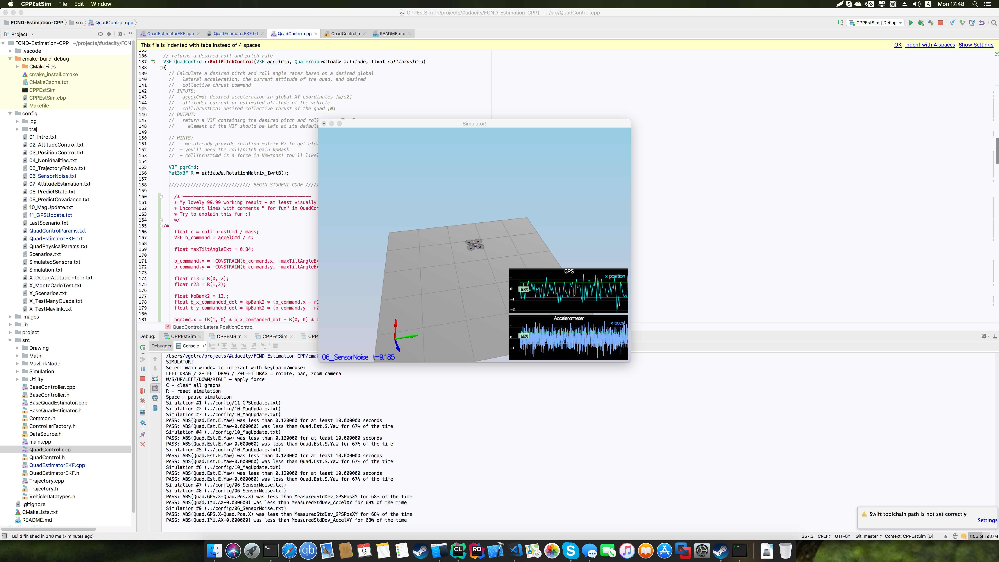
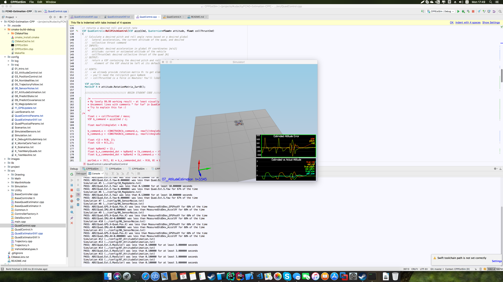
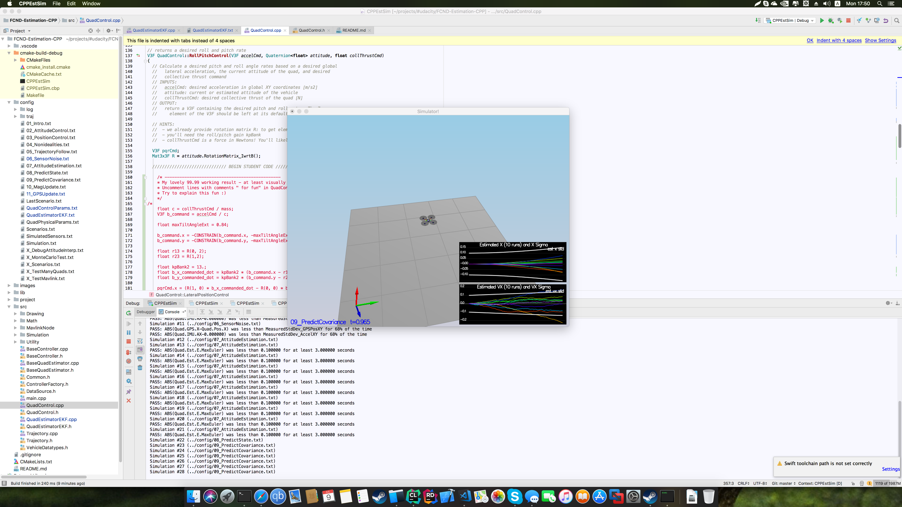
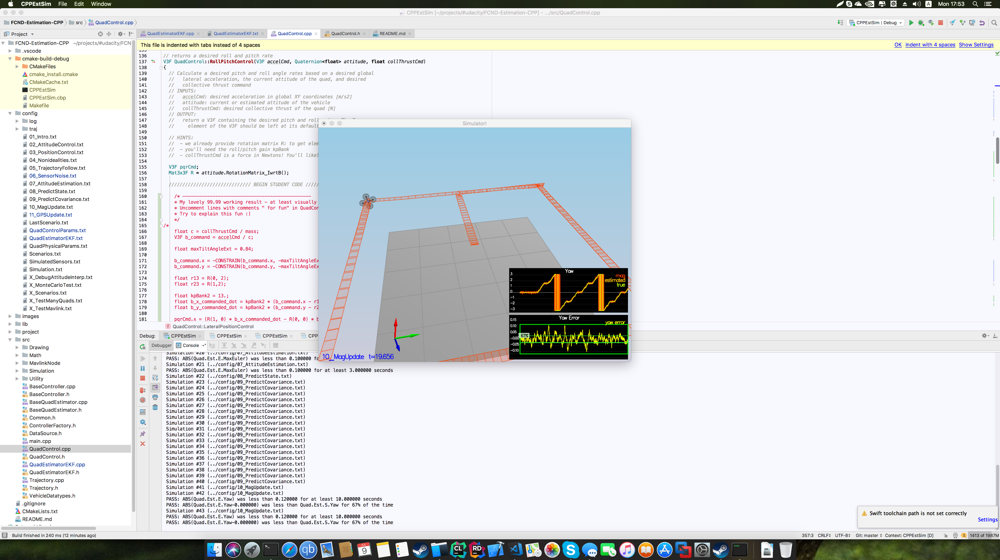
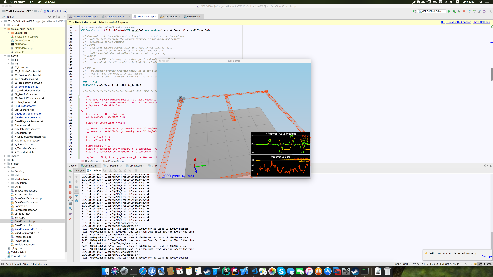
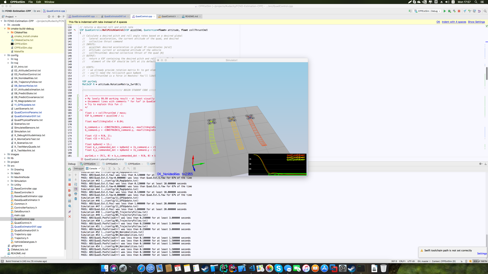
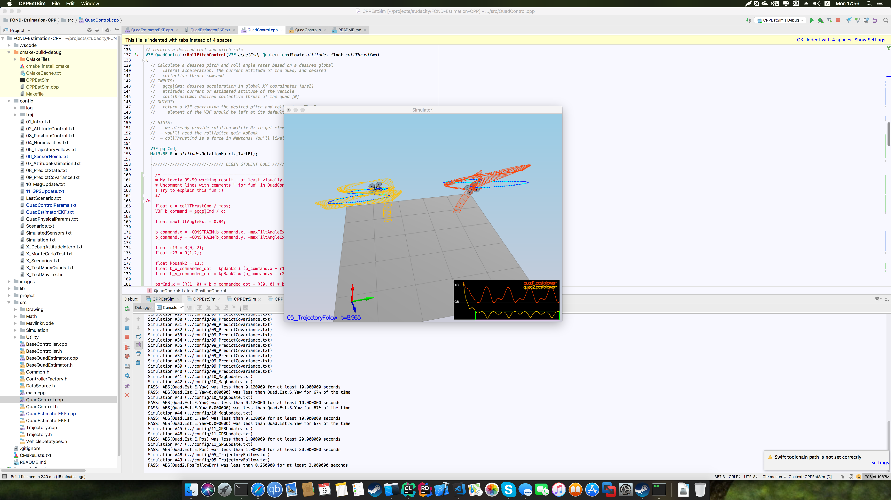

## Rubric

All criteria were done (also you can check Console output for every image for "PASS" items)

### Criteria 1
Determine the standard deviation of the measurement noise of both GPS X data and Accelerometer X data.

- Implemented

**NOTES: CSharp version gives better quality of precisions (for some unknown reason)**

#### Using ready projects 

- for CSharp in folder **SN/CSharp**
- for Python in folder **SN/Python**

#### Using code from scratch

##### With usage of dotnet 

- install dotnet
- create project with command
``` shell
dotnet new console -n SensorNoise
```

- copy files (Graph1.txt, Graph2.txt) with data to the folder
- replace content of **Program.cs** with C# script

``` csharp
using System;
using System.IO;
using System.Linq;

namespace SensorNoise
{
    class Program
    {
        static void Main(string[] args)
        {
            // for copied files into the binary folder
            var gps = @"Graph1.txt";
            var acc = @"Graph2.txt";

            // for project
            //var gps = @"/Users/vgotra/projects/#udacity/FCND-Estimation-CPP/config/log/Graph1.txt";
            //var acc = @"/Users/vgotra/projects/#udacity/FCND-Estimation-CPP/config/log/Graph2.txt";
            
            var gpsData = File.ReadAllLines(gps);
            var accData = File.ReadAllLines(acc);
            
            var gpsList = gpsData.Skip(1).Select(x => x.Split(',')).Select(x => double.Parse(x[1])).ToList();
            var accList = accData.Skip(1).Select(x => x.Split(',')).Select(x => double.Parse(x[1])).ToList();
            
            var avgGps = gpsList.Average();
            var avgAcc = accList.Average();
            
            var gpsSd = Math.Sqrt(gpsList.Select(x => x - avgGps).Select(x => Math.Pow(x, 2)).Sum() / (gpsList.Count - 1));
            var accSd = Math.Sqrt(accList.Select(x => x - avgAcc).Select(x => Math.Pow(x, 2)).Sum() / (accList.Count - 1));
            
            Console.WriteLine($"Avg GPS: {avgGps}, GPS Standard Deviation: {gpsSd}");
            Console.WriteLine($"Avg ACC: {avgAcc}, ACC Standard Deviation: {accSd}");
        }
    }
}

```

- execute command in folder with project with:
``` shell
dotnet run 
```

##### With usage of python 

- install python
- install anaconda or numpy
- configure and activate environment
- create a file **getsds.py** with script

``` python
import numpy as np
from numpy import genfromtxt

gps_data = np.array(genfromtxt('Graph1.txt', delimiter=',', skip_header=1, dtype=np.float64))
acc_data = np.array(genfromtxt('Graph2.txt', delimiter=',', skip_header=1, dtype=np.float64))

gps_sd = np.std(gps_data, axis=0, dtype=np.float64)[1]
acc_sd = np.std(acc_data, axis=0, dtype=np.float64)[1]

# quality of output is not so good
print("GPS Standard Deviation: {}".format(gps_sd))
print("ACC Standard Deviation: {}".format(acc_sd))

```
- copy files (Graph1.txt, Graph2.txt) with data to the folder with script

- run command 
``` shell
python getsds.py
```



### Criteria 2
Implement a better rate gyro attitude integration scheme in the UpdateFromIMU() function.

- Implemented



### Criteria 3
Implement all of the elements of the prediction step for the estimator.

- Implemented




### Criteria 4
Implement the magnetometer update.

- Implemented



### Criteria 5
Implement the GPS update.

- Implemented



### Criteria 6
Meet the performance criteria of each step.

- Done

### Criteria 7
De-tune your controller to successfully fly the final desired box trajectory with your estimator and realistic sensors.

- Done


